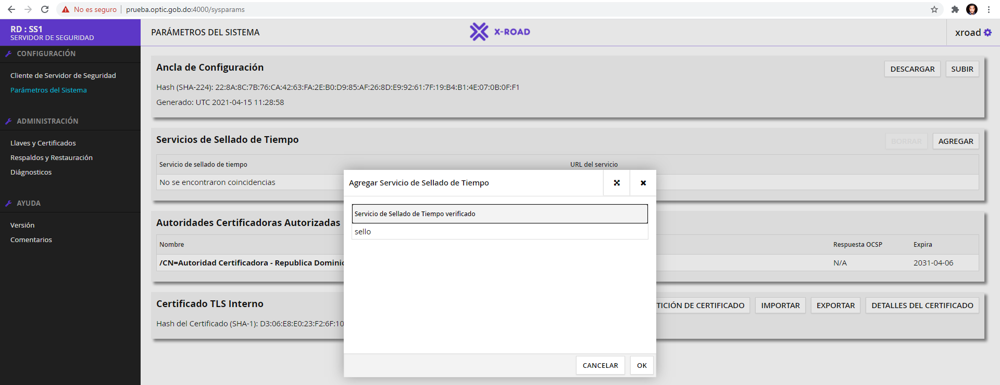

------

#### Configuración del servidor de seguridad.

Una vez se ingrese al dominio que lanza la instalación podrá visualizar una pantalla como esta:

> **Nota**: En la misma utilizara las credenciales del usuario creado en el paso anterior para acceder y empezar con la configuración de su servidor y el software utiliza los usuarios del sistema operativo y los grupos para acceder a la interfaz grafica.

Una vez se pueda ingresa a la plataforma encontraran una pantalla similar a la de abajo donde deberá agregar el archivo de configuración provisto por la red para poder conectarse al servidor central de configuraciones.

Una vez seleccione el archivo de configuraciones entonces procede a importarlo

Presiona continuar para empezar a completar los datos de su servidor de seguridad, en la imagen de abajo se muestran los siguientes campos:

|                                      |                                                              |
| :----------------------------------- | ------------------------------------------------------------ |
| **Clase de Miembro**                 | Tipo de entidad que se va a registrar en la red              |
| **Código del Miembro**               | Código asignado por el servidor central de configuraciones al momento de registrar la entidad |
| **Nombre del Miembro**               | Campo automático que mostrara el nombre de la entidad al momento de agregar el código del miembro |
| **Código del servidor de seguridad** | Código que se utilizara para visualizar en toda la red, el nombre utilizado para todos es SS1 (SS2, SS3, dependiendo de la cantidad de servidores agregados) |
| **PIN**                              | PIN para acceder al sistema                                  |
| **Repita PIN**                       | Confirmación del PIN para acceder al sistema                 |

Una vez se completen los pasos, quedaría de la siguiente manera

Cuando se completen los pasos entonces le mostrara una ventana emergente notificándole que el servidor de seguridad fue inicializado exitosamente. Una vez ingrese y todo haya funcionado correctamente, debería de poder visualizar un panel parecido al de abajo.

Se muestra un mensaje en el lado superior de color rojo, esto es debido a que hay que identificarse con el PIN para poder empezar a hacer las configuraciones de algunos servicios, procedemos a dar clic en el mensaje

Nos muestra esta sección donde debemos dar clic en el botón al lado derecho que dice "INGRESE PIN" y procedemos a identificarnos completando el campo y dando clic en "Ok", una vez se completa este paso vamos al menú lateral izquierdo y hacemos clic en "Parámetros del sistema" como muestra esta imagen.

En esta sección debemos de agregar el servicio de sellado de tiempo que se muestra en la segunda fila, este servicio es necesario para para poder identificarnos en el servidor de tiempo de las configuraciones globales de la red, procedemos dar clic en "AGREGAR".

Aquí seleccionamos el único disponible llamado "sello" y presionamos "OK", el mismo cerrara la ventana emergente mostrando ya la URL del servicio,, entonces procedemos a agregar las llaves de firma y autenticación de la red, este paso es obligatorio para que el servidor central pueda generarle sus certificados, para esto hacemos clic en la sección "Llaves y Certificados" del menú lateral izquierdo y podremos visualizar una sección como esta.

Aquí hay que seleccionar el Token y generar 2 (dos) llaves, una para FIRMA y otra para AUTORIZAR, una vez se crean entonces procedemos a crear los .DER de los certificados (se pueden crear en el formato .PEM sin ningún problema.

Para esto nos situamos en cualquiera de los dos y presionamos GENERAR CSR, el mismo abrirá una ventana con varias opciones de USO las cuales son

|           |                                                              |
| --------- | ------------------------------------------------------------ |
| FIRMAR    | Es la llave utilizada para firmar todos los mensajes entrantes y salientes de su servidor de seguridad a la red de X-Road, la misma hace uso del "sello" de tiempo. |
| AUTORIZAR | Es la llave utilizada para autorizar sus peticiones a cualquier miembro de la red de X-Road, de esto se encarga el servidor central de configuraciones. |

Al momento de generar las llaves, estas deben de ser enviadas al correo **joel.jaime@optic.gob.do** para que se les puedan generar las llaves e importarlas, una vez reciban el correo electrónico con ambos certificados es cuestión de importarlos al sistema y para esto nos colocamos en el apartado de "Llaves y Certificados" y seleccionamos los certificados y le damos a importar (el sistema automáticamente identificara cual certificado pertenece a que uso y lo auto-asigna).

> **Nota**: al momento de agregar los certificados se deben seleccionar y presionar activar y una vez activo presionar "REGISTRAR" para que el mismo envíe una solicitud al servidor central.

Una vez aprobado el proceso en el servidor central de configuraciones el su sistema estará listo y mostrara la siguiente imagen con color verde indicando que todo esta correctamente.

